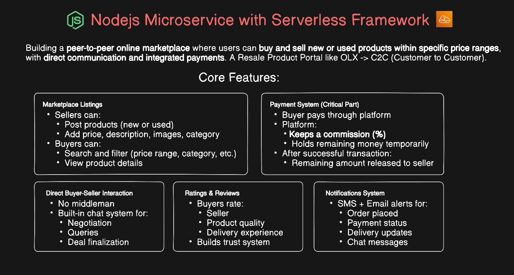
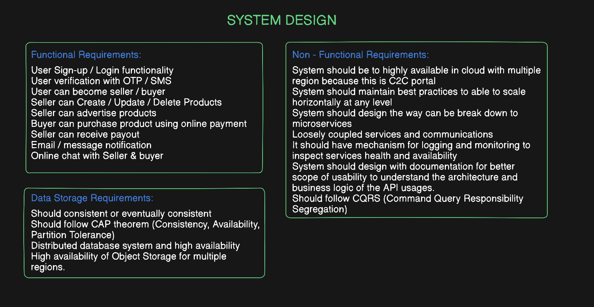
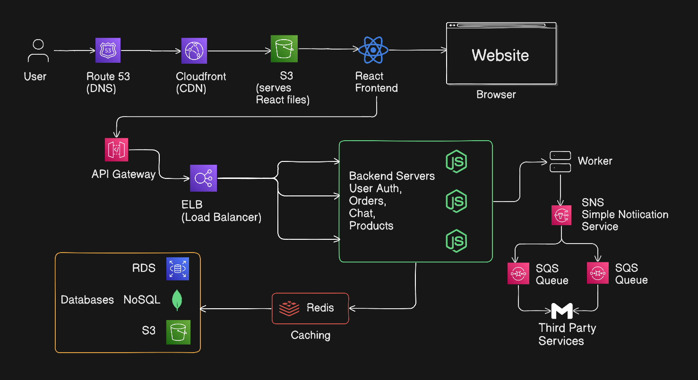
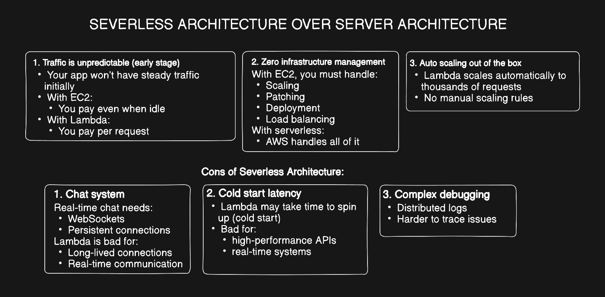
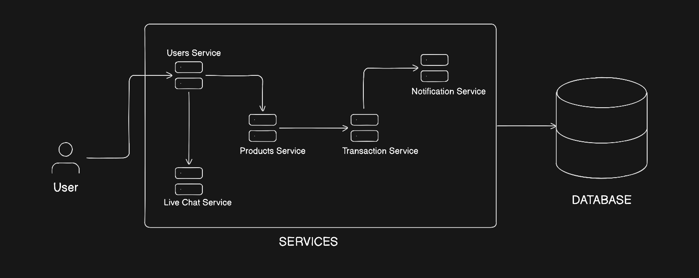
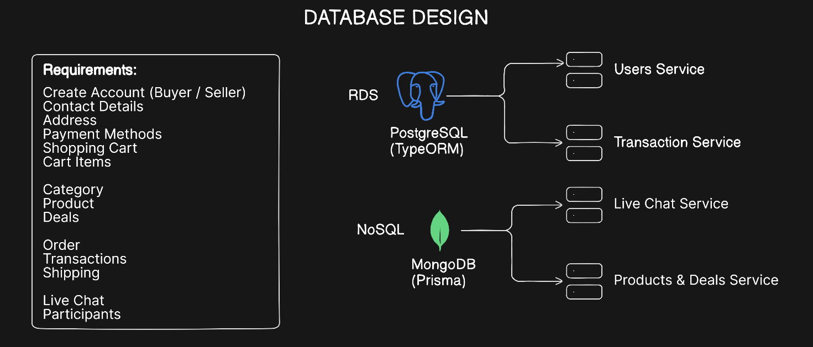
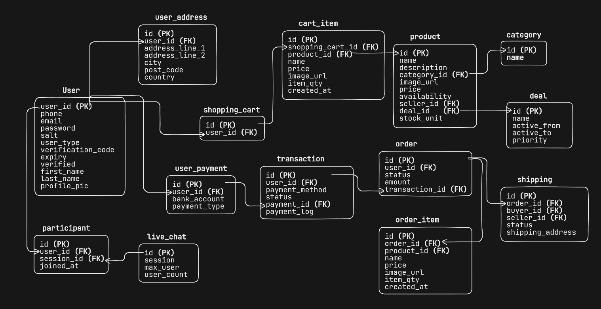
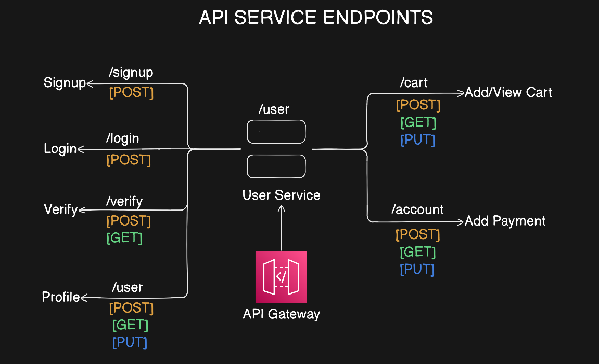
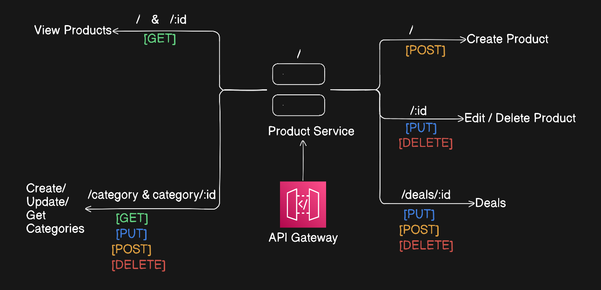
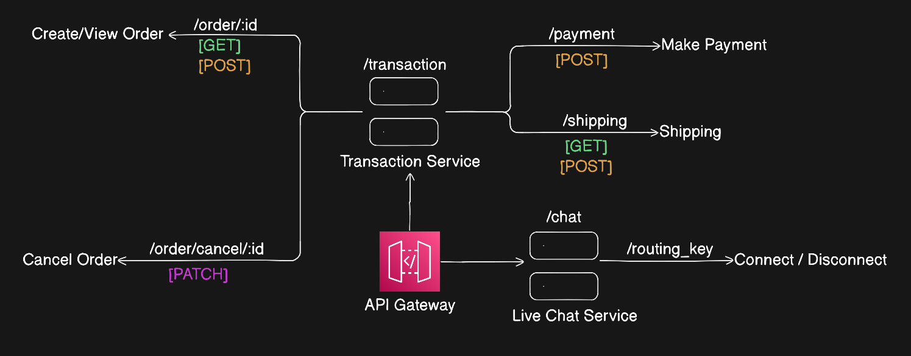

# E-Commerce C2C Marketplace System Design

Peer-to-peer marketplace (OLX-style) for buying and selling new/used products with chat and integrated payments.

Currently working on the user-service.

> Note: API endpoints are not publicly exposed since the services are deployed serverlessly on AWS.

## System Design

